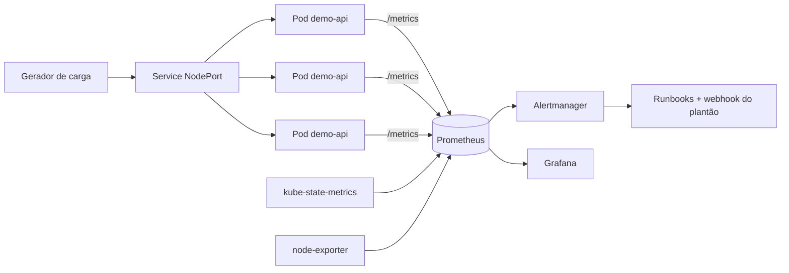

# k8s-observability-stack

Stack de observabilidade e confiabilidade rodando em Kubernetes local (kind), com SLOs
definidos formalmente, alertas por burn rate de error budget, dashboards de Grafana e
runbooks para cada alerta que aciona o plantão.

O objetivo do laboratório não é monitorar CPU: é responder à pergunta que importa em SRE,
"o serviço está bom o suficiente para o usuário?", e alertar apenas quando a resposta
começa a ficar negativa rápido demais.


## Arquitetura



## O que tem aqui

- Cluster kind de 3 nós definido em `kind/cluster.yaml`
- Aplicação FastAPI instrumentada com métricas RED (`app/`), com container rodando como
  usuário não-root, filesystem somente leitura e capabilities removidas
- `kube-prometheus-stack` instalado via Helm com values próprios (`monitoring/`)
- SLO de disponibilidade (99,9%) e de latência (95% abaixo de 250ms), documentados em `docs/slo.md`
- Recording rules e alertas multi-janela / multi-burn-rate em `monitoring/prometheus-rules-slo.yaml`
- Dashboard de SLO e error budget em `monitoring/grafana-dashboard-slo.json`
- Runbooks acionáveis, linkados na anotação `runbook_url` de cada alerta
- Script de incidente simulado para provar que o alerta dispara de verdade
- Pipeline de CI que valida os manifests com kubeconform, valida as regras com promtool e
  sobe um cluster kind efêmero para um teste end-to-end

## Pré-requisitos

Docker, kind, kubectl, helm e make.

## Subindo o ambiente

```bash
make up
```

O alvo executa, em ordem: criação do cluster, build da imagem, carga da imagem no kind,
instalação do stack de monitoramento, deploy da aplicação e publicação do dashboard.
Leva de 5 a 8 minutos na primeira execução.

Depois:

```bash
make carga        # tráfego sintético
make grafana      # http://localhost:3000  (admin / admin)
make prometheus   # http://localhost:9090
make alertmanager # http://localhost:9093
```

## Validando os alertas

Alerta que nunca disparou não vale nada. O script abaixo eleva a taxa de erro da aplicação
para 30%, o que corresponde a um burn rate de 300x sobre um SLO de 99,9%:

```bash
make incidente
```

Em cerca de 2 minutos o `DemoApiQueimaRapidaErrorBudget` sai de `pending` para `firing`,
o Alertmanager agrupa por `alertname` e `slo`, e a regra de inibição suprime o warning
correspondente para não duplicar o ruído. O script reverte a configuração sozinho.

## Decisões de projeto

**Por que burn rate em vez de alertar em "taxa de erro maior que 1%".** Um limiar fixo em
janela curta gera alarme falso a cada pico isolado, e em janela longa demora horas para
detectar uma queda severa. O modelo de duas janelas simultâneas (uma longa para confirmar
significância, uma curta para o alerta resolver rápido quando o problema acaba) resolve os
dois lados. Os fatores 14,4x, 6x e 3x vêm do SRE Workbook e mapeiam para porcentagem do
budget consumido, e não para um número arbitrário.

**Por que 4xx não conta como erro.** O SLI mede a saúde do serviço. Um cliente enviando
payload inválido não é falha da plataforma, e contabilizar isso faria o time gastar budget
com problema de terceiro.

**Por que `maxUnavailable: 0` no rolling update.** Com PDB de `minAvailable: 2` e 3 réplicas,
subir o pod novo antes de derrubar o antigo evita janela de capacidade reduzida durante o deploy.

**Por que promtool no CI.** Erro de sintaxe em PromQL só aparece quando o Prometheus recarrega
a configuração, normalmente em produção. Validar no pull request custa 10 segundos.

## Estrutura

```
app/           aplicação instrumentada + Dockerfile multi-stage
kind/          definição do cluster local
k8s/           Deployment, Service, HPA, PDB, ServiceMonitor
monitoring/    values do Helm, PrometheusRule com os SLOs, dashboard
scripts/       geração de carga, incidente simulado, extrator de regras
docs/          definição de SLO/SLI, política de error budget e runbooks
```

## Próximos passos

- Tracing distribuído com OpenTelemetry Collector e Tempo
- Logs centralizados com Loki e correlação trace/log no Grafana
- Regras de SLO geradas a partir de um arquivo declarativo (Sloth ou Pyrra)

## Autor

Luis Fernando Sales da Silva
[github.com/sales1x](https://github.com/sales1x) | saleslf@icloud.com
