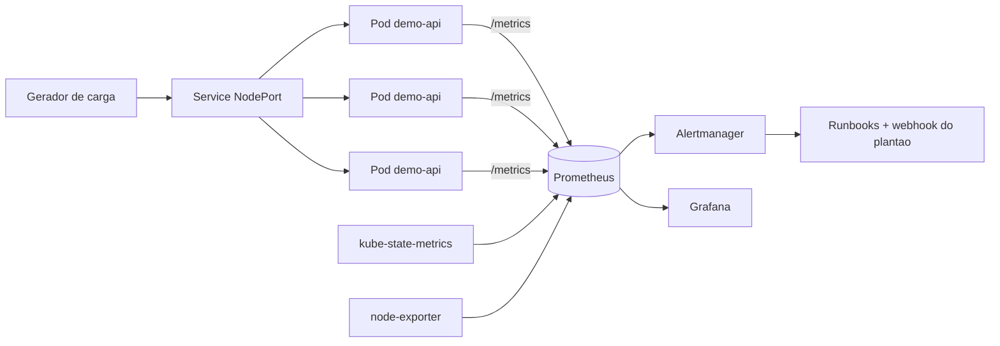

# k8s-observability-stack

Stack de observabilidade e confiabilidade rodando em Kubernetes local (kind), com SLOs
definidos formalmente, alertas por burn rate de error budget, dashboards de Grafana e
runbooks para cada alerta que aciona o plantao.

O objetivo do laboratorio nao e monitorar CPU: e responder a pergunta que importa em SRE,
"o servico esta bom o suficiente para o usuario?", e alertar apenas quando a resposta
comeca a ficar negativa rapido demais.


## Arquitetura



## O que tem aqui

- Cluster kind de 3 nos com `kind/cluster.yaml`
- Aplicacao FastAPI instrumentada com metricas RED (`app/`), com container rodando como
  usuario nao-root, filesystem somente leitura e capabilities removidas
- `kube-prometheus-stack` instalado via Helm com values proprios (`monitoring/`)
- SLO de disponibilidade (99,9%) e de latencia (95% < 250ms) documentados em `docs/slo.md`
- Recording rules e alertas multi-janela / multi-burn-rate em `monitoring/prometheus-rules-slo.yaml`
- Dashboard de SLO e error budget em `monitoring/grafana-dashboard-slo.json`
- Runbooks acionaveis, linkados na anotacao `runbook_url` de cada alerta
- Script de incidente simulado para provar que o alerta dispara de verdade
- Pipeline de CI que valida manifests com kubeconform, valida as regras com promtool e
  sobe um cluster kind efemero para um teste end-to-end

## Pre-requisitos

Docker, kind, kubectl, helm e make.

## Subindo o ambiente

```bash
make up
```

O alvo executa, em ordem: criacao do cluster, build da imagem, carga da imagem no kind,
instalacao do stack de monitoramento, deploy da aplicacao e publicacao do dashboard.
Leva de 5 a 8 minutos na primeira execucao.

Depois:

```bash
make carga        # trafego sintetico
make grafana      # http://localhost:3000  (admin / admin)
make prometheus   # http://localhost:9090
make alertmanager # http://localhost:9093
```

## Validando os alertas

Alerta que nunca disparou nao vale nada. O script abaixo eleva a taxa de erro da aplicacao
para 30%, o que corresponde a um burn rate de 300x sobre um SLO de 99,9%:

```bash
make incidente
```

Em cerca de 2 minutos o `DemoApiQueimaRapidaErrorBudget` sai de `pending` para `firing`,
o Alertmanager agrupa por `alertname` e `slo`, e a regra de inibicao suprime o warning
correspondente para nao duplicar o ruido. O script reverte a configuracao sozinho.

## Decisoes de projeto

**Por que burn rate em vez de alertar em "taxa de erro > 1%".** Um limiar fixo em janela
curta gera alarme falso a cada pico isolado, e em janela longa demora horas para detectar
uma queda severa. O modelo de duas janelas simultaneas (uma longa para confirmar
significancia, uma curta para o alerta resolver rapido quando o problema acaba) resolve os
dois lados. Os fatores 14,4x, 6x e 3x vem do SRE Workbook e mapeiam para porcentagem do
budget consumido, nao para um numero arbitrario.

**Por que 4xx nao conta como erro.** O SLI mede a saude do servico. Um cliente enviando
payload invalido nao e falha da plataforma, e contabilizar isso faria o time gastar budget
com problema de terceiro.

**Por que `maxUnavailable: 0` no rolling update.** Com PDB de `minAvailable: 2` e 3 replicas,
subir o pod novo antes de derrubar o antigo evita janela de capacidade reduzida durante o deploy.

**Por que promtool no CI.** Erro de sintaxe em PromQL so aparece quando o Prometheus recarrega
a config, normalmente em producao. Validar no pull request custa 10 segundos.

## Estrutura

```
app/           aplicacao instrumentada + Dockerfile multi-stage
kind/          definicao do cluster local
k8s/           Deployment, Service, HPA, PDB, ServiceMonitor
monitoring/    values do Helm, PrometheusRule com os SLOs, dashboard
scripts/       geracao de carga, incidente simulado, extrator de regras
docs/          definicao de SLO/SLI, politica de error budget e runbooks
```

## Proximos passos

- Tracing distribuido com OpenTelemetry Collector + Tempo
- Logs centralizados com Loki e correlacao trace <-> log no Grafana
- Regras de SLO geradas a partir de um arquivo declarativo (Sloth ou Pyrra)
